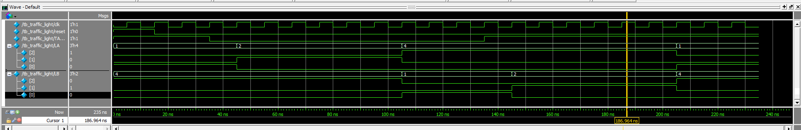

cat <<EOF > README.md
# Traffic-Light-FSM

A 4-state Traffic Light Controller designed using **SystemVerilog** as part of the ELE432 course.

## Project Description
This project implements a finite state machine (FSM) to manage traffic lights at a highway-side street intersection. It ensures:
* A 5-clock cycle delay for yellow lights.
* Efficient switching based on the sensor input (**TAORB**).
* Reliable state transitions (S0 to S3).

## Files
* TrafficLight.sv: Main RTL design.
* tb_traffic_light_fsm.sv: Testbench for functional simulation.

## Tools Used
* **Quartus Lite**: For synthesis.
* **Questa Altera FPGA**: For RTL simulation and waveform verification.
EOF

## Simulation Results
The following waveform demonstrates the correct state transitions and timing (5-clock cycle delays for yellow lights):

